# ETAAcademy-Audit: 16. Mutation Testing

<table>
  <tr>
    <th>title</th>
    <th>tags</th>
  </tr>
  <tr>
    <td>16 Mutation Testing</td>
    <td>
      <table>
        <tr>
          <th>audit</th>
          <th>basic</th>
          <th>article</th>
          <td>Mutation Testing</td>
        </tr>
      </table>
    </td>
  </tr>
</table>

[Github](https://github.com/ETAAcademy)｜[Twitter](https://twitter.com/ETAAcademy)｜[ETA-Audit](https://github.com/ETAAcademy/ETAAcademy-Audit)

Authors: [Evta](https://twitter.com/pwhattie), looking forward to your joining

# The Evolution of Mutation Testing: Advanced Techniques for Smart Contracts, ZK Circuits, and Automated Test Generation

Mutation testing, a white-box technique that evaluates test suite quality by generating mutants through small syntactic modifications to the original code and determining whether test cases can "kill" these mutants, has evolved from its traditional use in smart contract testing into several innovative directions. For zero-knowledge (ZK) circuits, the TCCT (Trace-Constraint Consistency Test) method specifically detects inconsistencies between computation traces and circuit constraints, uncovering ZK-specific vulnerabilities such as under-constrained and over-constrained bugs through program mutation strategies, genetic algorithm optimization, and static analysis-driven target selection. In addition, multi-agent frameworks based on large language models (LLMs) have shifted the focus of test generation from simple code coverage to mutation score, leveraging specialized LLM agents, panel discussion strategies for cross-verification, and the integration of mutation feedback into prompts—enabling a leap from merely executing code to truly verifying functional correctness. Furthermore, taint-guided mutation innovatively utilizes the havoc mode in fuzzing to identify and target "hot bytes" in the input without any additional execution overhead, significantly improving vulnerability discovery efficiency. Together, these advances form a modern landscape of mutation testing technologies across smart contracts, privacy-preserving computation, automated test generation, and fuzzing.

---

Mutation testing is a fault-based white-box testing technique that is especially valuable for smart contracts, which, once deployed, cannot be modified. Traditional testing relies on clearly defined "expected results" to verify correctness. However, due to the complex state dependencies and external interactions of smart contracts—such as reliance on blockchain state, timestamps, and gas prices—defining precise expected outcomes is often challenging. Mutation testing offers a solution by not just revealing whether a program is correct, but by evaluating the quality of the test suite itself. For example, even if you achieve 100% test coverage (every line is executed), many tests may simply "run through" the code without actually verifying its behavior—mutation testing can expose such weaknesses.

**What is Mutation Testing?**

Mutation testing works by introducing artificial faults (called "mutants") into the original code through small syntactic changes (for example, changing `a < b` to `a > b`). The effectiveness of a test suite is then measured by its ability to "kill" these mutants—that is, to detect the introduced faults. The core metric is the **mutation score**, calculated as the proportion of killed mutants to the total number of non-equivalent mutants. Mutation testing is not about checking program correctness, but about assessing the quality of the tests. It does not depend on precise expected results; instead, it can use **metamorphic relations (MRs)** to verify behavioral consistency. This approach quantifies test effectiveness through error detection rates and can uncover bugs that traditional testing might miss, making it a crucial step before deploying smart contracts.

**Practical Use and Tools**

Mutation testing is primarily used in software development (especially in industry), but also finds applications in teaching, learning, and research. While many mutation testing tools are popular in academia, industry and open-source communities prefer tools that are easy to use, integrate well, and have active communities. Popular tools include **Infection** (PHP), **PIT** (Java), **Humbug** (PHP), **StrykerJS** (JavaScript), and **Mutant** (Ruby), each typically targeting specific programming languages. There are also tools for higher-level models (UML, Z), spreadsheets, regular expressions, and even smart contracts. These tools are far more widely used in practice than those commonly cited in academic papers.

**The Mutation Testing Process**

- **Generate Mutants:** Use mutation operators to make single syntactic changes to the original program, creating multiple mutants. For example, change `x > y` to `x >= y`, or `a + b` to `a - b`.
- **Run the Test Suite:** First, run the test suite T on the original program to ensure correctness. Then, run T on each mutant. If a mutant produces different output from the original, the test suite has "killed" that mutant.
- **Calculate the Score:** Compute the mutation score as the number of killed mutants divided by the total number of non-equivalent mutants. The higher the score, the better (ideally 1).
- **Handle Equivalent Mutants:** Some mutants, despite syntactic differences, are functionally identical to the original and cannot be killed by any test case. Detecting such equivalent mutants is undecidable and requires manual analysis.

**Core Assumptions**

Mutation testing is based on two key hypotheses:

- **Competent Programmer Hypothesis (CPH):** Programmers usually write code that is "close to correct," and most errors are simple syntactic mistakes. Therefore, simple mutations (like single operator replacements) are sufficient to simulate these errors.
- **Coupling Effect:** A test suite that can detect all simple faults is also likely to detect most complex faults. Thus, generating and killing simple mutants indirectly covers more complex bugs.

**Types of Mutation Operators**

Mutants are typically small and can be categorized as follows:

| Operator Type        | Description                                                     |
| -------------------- | --------------------------------------------------------------- |
| Conditional Boundary | Replace conditional operators with inclusive/exclusive variants |
| Conditional Negation | Replace conditional operators with their inverse                |
| Arithmetic Inversion | Replace arithmetic operators with their inverse                 |
| Increment Mutation   | Replace increment statements with their inverse                 |
| Modifier Removal     | Remove applied modifiers                                        |

```mermaid
graph TD
A["Vertigo Mutation Operators"] --> B["Conditional Boundary Replacement"]
A --> C["Conditional Negation"]
A --> D["Arithmetic Operator Inversion"]
A --> E["Increment Statement Mutation"]
A --> F["Modifier Removal"]

    B --> B1["x > y → x >= y<br/>x < y → x <= y"]
    C --> C1["x == y → x != y<br/>x && y → x || y"]
    D --> D1["x + y → x - y<br/>x * y → x / y"]
    E --> E1["Reverse: x++ → x--<br/>Mirror: x++ → ++x"]
    F --> F1["Remove require()<br/>Remove modifier checks"]
```



<details><summary>Code</summary>

Original code:

```solidity
function contribute() external payable {
    require(msg.value > 0, "Amount must be positive");
    require(msg.value >= minAmount, "Below minimum");

    if (block.timestamp < endTime) {
        totalRaised += msg.value;
        contributorCount++;
    }
}
```

Mutated version:

```solidity
function contribute() external payable {
    require(msg.value >= 0, "Amount must be positive");        // Boundary mutation
    require(msg.value != minAmount, "Below minimum");          // Conditional negation

    if (block.timestamp > endTime) {                           // Conditional negation
        totalRaised -= msg.value;                              // Arithmetic inversion
        contributorCount--;                                    // Increment inversion
    }
}
```

</details>

---

## 1. ZK Circuit Testing and Mutation

**Zero-Knowledge (ZK) circuits** are foundational to privacy-preserving computation and blockchain applications, powering technologies such as anonymous cryptocurrencies, privacy smart contracts, and verifiable machine learning. In practice, developers must prove the correctness of complex computations rather than just static secrets. Manually constructing circuit constraints is both complex and error-prone, which is why high-level DSLs like Circom are essential for simplifying development. The typical ZK system workflow includes:

- **Circuit Compilation:** The ZK program (e.g., a Circom file) is compiled into a "witness computation program" and "circuit constraints."
- **Proof Generation:** The prover uses the witness computation program and input to generate an execution trace (the witness), then uses a proving system (such as snarkjs) to generate a proof π for circuit C and witness w. The witness consists of the prover’s secret inputs and intermediate values, while the constraints (often expressed as R1CS—Rank-1 Constraint System) restrict the inputs, outputs, and intermediates.
- **Verification:** The verifier uses the circuit constraints, public outputs, and the proof to decide whether to accept the computation.

High-level DSLs like **Circom** allow developers to describe both the witness computation logic and the circuit constraints in a flexible, component-based way. However, this flexibility also increases the risk of bugs. Developers must ensure that the computation logic and circuit constraints are perfectly aligned, and must also understand the subtleties of finite field arithmetic. The main vulnerabilities are **under-constrained circuits** (which accept invalid witnesses, enabling proof forgery) and **over-constrained circuits** (which may reject valid witnesses, causing functional errors). Non-intuitive behaviors in finite fields (e.g., `iszero(2+3)` equals 1 in mod 5, since 2+3=5≡0) can also lead to mistakes. Existing tools often suffer from high false positive rates in static analysis, limited semantic depth, or overlook intermediate computations and program aborts, missing many real bugs.

<details><summary>Code</summary>

```circom
// Logic function
fn RShift1(x) {
    y = x >> 1
    b = x - y * 2
    assert(b*(1-b) == 0)
    return y
}

// Under-constrained circuit (in F₁₁, x=7)
// Expected: y=3, b=1
// But y=9, b=0 also satisfies the constraints since 7-9×2=-11≡0 mod 11
(b = x-y*2) && (b*(1-b) = 0)

// Over-constrained circuit
// This would reject valid traces like {x:3, y:1, b:1}
(b = x - y*2) && (b = 0)
```

</details>

### TCCT: Trace-Constraint Consistency Test

**TCCT (Trace-Constraint Consistency Test)** models ZK circuit vulnerabilities as inconsistencies between the "computation execution trace" and the "circuit constraints." It can detect:

- **Under-constrained bugs** (soundness: invalid traces accepted by the circuit),
- **Over-constrained bugs** (completeness: valid traces rejected by the circuit),
- **Intermediate computation and aborts** (about half of real-world bugs are due to program aborts, but the circuit constraints are still satisfied, allowing attackers to forge proofs).

Previous models only considered under- and over-constrained cases (i.e., whether the circuit allows multiple outputs for the same input, or rejects all input/output pairs). However, in abort-type bugs, the circuit may become "empty" (accepting everything), which is not detected by traditional models but is caught by TCCT.

TCCT is language-agnostic and provides a theoretical foundation for ZK circuit analysis tools. The detection process involves generating multiple mutants of the witness computation program, heuristically sampling many inputs, running all mutants on all inputs, and checking for TCCT violations (i.e., inconsistencies between traces and constraints). If a violation is found, a concrete counterexample is produced to help developers locate and fix the bug.

#### Key Concepts

- **ZK Program:** A pair (P, C), where P is the computation logic and C is the circuit constraint. P takes input x and outputs (intermediate z, output y) or aborts (⊥). C checks if (x, z, y) satisfies the constraints.
- **Execution Trace T(P):** All (x, z, y) triples where P(x) returns (z, y) successfully.
- **Constraint Satisfaction Set S(C):** All (x, z, y) triples where C(x, z, y) = true.
- **Projection $Π_{xy}$:** Maps (x, z, y) sets to (x, y) pairs.

#### Core Vulnerabilities

- **Under-Constrained:** $Π_{xy}(S(C)) \ Π_{xy}(T(P)) ≠ ∅$; there exists (x, y) accepted by C but not produced by P.
- **Over-Constrained:** T(P) \ S(C) ≠ ∅; there exists (x, z, y) produced by P but not accepted by C.
- **TCCT Consistency:** $Π_{xy}(S(C)) \ Π_{xy}(T(P)) = ∅$ and T(P) \ S(C) = ∅; all execution traces satisfy the constraints, and all accepted input/output pairs can be produced by P. Deciding under- or over-constrained is NP-complete; TCCT as a whole is co-NP-complete.

**TCCT Analysis Example (q=3):**

An `assert` only checks at runtime and does not generate a constraint. Any combination of x₁ and x₂ can pass the constraint, allowing attackers to forge proofs. Existing tools cannot detect this, but TCCT can. The fix is to replace `assert` with an explicit constraint (`===`). Now, T(P) ⊆ S(C): all real execution traces pass the circuit constraints (no over-constrained false negatives). S(C) may include more intermediate values than T(P), but as long as the input-output pairs match, TCCT considers the circuit safe. This "intermediate value diversity" is sometimes necessary for performance optimization in ZK circuits. TCCT focuses on input-output consistency, not a one-to-one mapping of all intermediate values.

Traditional static analyzers may falsely report vulnerabilities when S(C) has more intermediate values than T(P), but TCCT does not.

| T(P) |     |     | S(C) |     |     |
| ---- | --- | --- | ---- | --- | --- |
| x    | z   | y   | x    | z   | y   |
| 0    | 0   | 1   | 0    | 0   | 1   |
|      |     |     | 0    | 1   | 1   |
|      |     |     | 0    | 2   | 1   |
| 1    | 1   | 0   | 1    | 1   | 0   |
| 2    | 2   | 0   | 2    | 2   | 0   |

<details><summary>Code</summary>

```circom
// Vulnerable circuit (under-constrained)
template Verify() {
    signal input x1;
    signal input x2;

    component h = Hash();
    h.x <== x1;
    assert(x2 == h.y);  // Only runtime check, no constraint!
}

// Safe circuit (no vulnerability)
template IsZero() {
    signal input x;
    signal output y;
    signal z;

    z <-- x != 0 ? 1/x : 0;  // Weak assignment, no constraint
    y <== -x*z + 1;         // Strong assignment, with constraint
    x*y === 0;              // Equality constraint
}
```

</details>

### Beyond Traditional Testing: Mutation Strategies for ZK Circuits

Traditional testing methods, such as fuzzing, typically focus on mutating inputs and monitoring for program crashes or exceptions. However, for ZK circuits—especially those written in languages like Circom—this approach is insufficient for uncovering deeper constraint logic bugs. To address this, advanced mutation testing strategies have been developed, incorporating program mutation, targeted input selection, and whitelisting mechanisms.

#### Program Mutation

Unlike input-only fuzzing, program mutation targets the ZK program itself, generating diverse program variants by mutating weak assignments and assertions. For example, operators may be replaced or expressions altered, creating a mutated program P' from the original P. Both P and P' are then executed on the same input, and their execution traces are compared. If the original program's output satisfies the circuit constraint but the mutated program's output is different and also satisfies the constraint, this indicates an **under-constrained** bug. Conversely, if the original program's output does not satisfy the constraint, it signals an **over-constrained** issue.

<details><summary>Code</summary>

The process can be summarized as follows:

```
Algorithm 1: Fuzzing with Program Mutation to solve TCCT
   for i ← 1, 2, ... MAX_GENERATION do
     Generate input data x
     Mutate P to P'
     Execute both P and P' on x:
       P(x) = (z, y), P'(x) = (z', y')
     if y ≠ ⊥ and C(x, z, y) = false then
       Report "Over-Constrained Problem"
     if y' ≠ ⊥ and y ≠ y' and C(x, z', y') = true then
       Report "Under-Constrained Problem"
```

</details>

#### Mutation Strategies for Circom

- **Assertion Removal:** To reduce the chance of program aborts after mutation, all `assert` statements are removed before mutation. This allows the mutated program to continue execution even if logic errors are introduced, increasing the likelihood of discovering subtle bugs.
- **Weak-Assignment Transformations:** In Circom, strong assignments (`<==`) are not mutated as they directly affect constraints and can easily break the circuit. Instead, weak assignments (`<--`), which do not generate constraints, are mutated. This can be done by:
  - **Random Replacement:** Replacing the right-hand side of `<--` with a randomly sampled value from a skewed distribution.
  - **Operator Replacement:** Swapping operators (arithmetic, bitwise, logical) with others of the same type.
- **Optional Mutations:** Additional diversity is introduced by randomly adding values or deleting expressions.

#### Evolutionary Search and Fitness

A genetic algorithm (GA) is used to retain mutants most likely to expose vulnerabilities. The **fitness function** is based on "constraint error": for each constraint equation $a_i == b_i$, the error is $|a_i - b_i|$ (zero if satisfied). The total error is the sum across all constraints. Mutants with different outputs from the original and minimal error are prioritized. **Roulette wheel selection** ensures that mutants with lower error are more likely to be selected for the next generation.

#### Static Analysis-Driven Target Selection

The input space for ZK circuits is vast, and pure random sampling rarely covers critical vulnerabilities. Static analysis is used to automatically identify high-risk patterns (such as division by zero, hash checks, or array out-of-bounds), guiding both input generation and program mutation. This **target selector** mechanism increases the probability of finding bugs.

- **Skewed Distribution:** Empirical analysis shows that many bugs are triggered by edge-case inputs, such as 0, 1, or values near the field modulus q. Sampling is biased to increase the likelihood of these values (e.g., 0 and 1: 15%, small integers: 34%, large values near q: 50%, others: 1%).
- **Static Analysis Assistance:** For example, if a division's denominator might be zero, the input generator will prioritize zero values to expose division-by-zero constraint bugs. For constraints like $y = x_1 / x_2$ (often written as $y \cdot x_2 = x_1$), the system will generate inputs where both $x_1$ and $x_2$ are zero, or solve for suitable values using algorithms like Tonelli-Shanks for quadratic residues.

#### Key Target Selector Patterns

| Selector Type     | Typical Pattern   | Purpose                       |
| ----------------- | ----------------- | ----------------------------- |
| Zero-Division     | $y <-- x_1 / x_2$ | Under-constrained detection   |
| Invalid Array Sub | x[too_big_val]    | Prevent out-of-bounds crashes |
| Hash-Check        | $h(x_1) === x_2$  | Under-constrained detection   |
| White List        | IsZero, Num2Bits  | Skip known-safe templates     |

- **Zero-Division:** Circom does not support native division, so developers simulate it with weak assignment and a constraint (e.g., $y <-- x_1 / x_2; y * x_2 === x_1;$). If both $x_1$ and $x_2$ are zero, any y satisfies the constraint, leading to under-constrained bugs. Static analysis detects this and ensures such inputs are generated.
- **Hash-Check:** For circuits that check if an input's hash matches a given value (e.g., password verification), random mutation rarely produces valid $(x_1, x_2)$ pairs where $x_2 = Hash(x_1)$. Static analysis increases the chance of generating such pairs, improving bug detection.
- **Invalid Array Subscript:** Mutations may produce out-of-bounds indices, causing crashes. The system monitors crash frequency and reduces the maximum input value if necessary to maintain stability.
- **White List:** Some Circomlib templates (e.g., IsZero, Num2Bits) are formally verified as safe. Mutating these is pointless, so a whitelist allows the system to skip them and focus resources on more error-prone areas.

<details><summary>Code</summary>

```circom
// Zero-Division
template ZeroDiv () {
  signal input x1;
  signal input x2;
  signal output y;

  y <-- x1 / x2;
  y * x2 === x1;
}
```

```circom
// Hash-Check
template HashCheck () {
  signal input x1;
  signal input x2;

  component h = Hash();
  h.x <== x1;
  x2 === h.y;
}
```

</details>

---

## 2. LLM Automated Testing + Mutation

In the field of Automated Unit Test Generation (AUTG), the mainstream algorithms include Random Testing, Genetic Algorithms (GA), and Particle Swarm Optimization (PSO)—all of which fall under the umbrella of Search-Based Evolutionary Testing. Random testing is simple and easy to use, but it tends to be inefficient and produces redundant tests, making it more suitable for scenarios where source code is unavailable. In contrast, GA and PSO represent the core of evolutionary automated testing, offering significant improvements in both coverage and efficiency. GA is flexible and highly adaptable, but it can be slow and prone to getting stuck in local optima. PSO, on the other hand, converges faster and requires less computation, and is generally considered superior to GA in practice. Notable tools in real-world applications include EvoSuite (which uses GA), Randoop (random testing), and various PSO-based tools.

When evolutionary algorithms (GA, PSO) are combined with mutation testing, they can generate smaller, higher-quality test suites. PSO-MT (Particle Swarm Optimization + Mutation Testing) is particularly efficient, with two main approaches: RGA-MS (Real Coded Genetic Algorithm for Highest Mutation Score) and PSO-MT.

- **RGA-MS** first uses a standard genetic algorithm to generate test cases, then applies a Fault Detection Minimization (FDM) step to sort the cases by mutation score, retaining only the minimal set needed to cover all mutants. The resulting test suite is smaller, higher quality, and more readable, capable of killing all known mutants. However, because mutation testing itself is computationally intensive, the overall process can be time-consuming. While GA-MT (GA + Mutation Testing) is effective, it is generally less efficient than PSO-MT.

- **PSO-MT** uses particle swarm optimization to generate test cases, evaluating their fitness with mutation testing and updating particle positions and velocities until convergence. PSO-MT achieves results comparable to GA-MT but converges faster, produces fewer test cases, and is more computationally efficient—making it the preferred choice, especially for large-scale problems.

---

### LLM-Based Automated Unit Test Generation and Mutation

Manual unit testing—especially in strongly typed languages like Java—is notoriously time-consuming, tedious, and requires significant domain expertise. While traditional automated testing methods such as fuzzing and symbolic execution can generate high-coverage test prefixes, their test oracles (assertions) often merely record the current behavior of the implementation (regression oracles), rather than truly verifying functional correctness. For example, EvoSuite, a widely used Java automated test generation tool, leverages genetic algorithms to maximize code coverage and automatically generates assertions. However, these assertions simply reflect the current code’s behavior and may not align with the actual requirements. Recently, large language models (LLMs) have shown promise in generating more requirement-aligned assertions from natural language descriptions, but existing approaches often require model fine-tuning or rely on external tools (like EvoSuite), and are prone to hallucinations and redundant output.

A new end-to-end, multi-agent LLM framework addresses these challenges—requiring neither fine-tuning nor external tools. It is based entirely on prompt engineering and off-the-shelf LLMs. Multiple specialized LLM agents collaborate, each with a clear role, to incrementally generate and refine JUnit test cases. Key innovations include the **Panel Discussion strategy**, where multiple LLMs cross-validate assertions to reduce hallucinations and uncertainty, thereby improving oracle accuracy. The **Dual-LLM Pipeline** uses a base LLM to distill the verbose output of a reasoning LLM, producing concise, structured assertion evaluations. Mutation testing tools like PiTest are used to automatically inject "mutants" (small bugs) into the code, and the ability of the test suite to detect these mutants (i.e., "kill" them) is measured. The more mutants killed, the higher the mutation score, indicating a more effective test suite.

#### Multi-Agent Collaboration Workflow

- **Initializer**: Generates the initial test skeleton.
- **Planner**: Designs the test plan to improve coverage.
- **Tester**: Produces executable test cases.
- **Inspector**: Checks the quality of test cases.
- **Requirement Engineer**: Extracts requirements from natural language descriptions.
- **Panelist**: Multiple reasoning LLMs independently evaluate assertions, simulating an "expert panel discussion."
- **Interpreter**: Summarizes the key points from each panelist’s output.
- **Curator**: Aggregates all opinions to reach consensus and generate the final, accurate assertion.

#### Running Example

Suppose we are given a natural language description of a function, specifying its input, core logic, and output. For example: the input is a list of integers, and each element is transformed and summed according to the following rules:

$$
lst'[i] =
\begin{cases}
lst[i]^2, & \text{if } i \bmod 3 = 0 \\
lst[i]^3, & \text{if } i \bmod 3 \neq 0 \text{ and } i \bmod 4 = 0 \\
lst[i], & \text{else}
\end{cases}
$$

- If the index $i$ is a multiple of 3, square the element.
- If $i$ is not a multiple of 3 but is a multiple of 4, cube the element.
- Otherwise, leave the element unchanged.

<details><summary>Code</summary>

```java
package original;
import java.util.ArrayList;
import java.util.List;

class SumSquares1 {
    public static int sumSquares(List<Object> lst) {
        List<Integer> result = new ArrayList<Integer>();
        for (int i = 0; i < lst.size(); i++) {
            if (i % 3 == 0) {
                result.add((int) lst.get(i) * (int) lst.get(i));
            }
            else if (i % 4 == 0 && i % 3 == 0) {
                result.add((int) lst.get(i) * (int) lst.get(i) * (int) lst.get(i));
            }
            else {
                result.add((int) lst.get(i));
            }
        }

        int sum = 0;
        for (int i = 0; i < result.size(); i++) {
            sum += result.get(i);
        }
        return sum;
    }
}
```

</details>

#### The Three-Step Process

A key innovation lies in decomposing the complex task of unit test generation into specialized roles, each handled by a dedicated LLM agent. This division of labor helps prevent role confusion and ensures that each aspect of the process is addressed with focused expertise. By employing a multi-agent panel discussion mechanism, the system effectively filters and corrects hallucinations that may arise during assertion generation, leading to more reliable test oracles. Additionally, a dual-pipeline approach is adopted, where a reasoning LLM provides deep analytical insights while a base LLM refines and condenses the output, striking a balance between depth of reasoning and conciseness. This collaborative and structured workflow significantly enhances both the accuracy and efficiency of automated test generation. The overall process unfolds in three main stages:

- **Initialization**: The Initializer Agent generates an initial test file (v₀), which may contain syntax errors or not conform to Java/JUnit standards. Validation checks and corrects these errors, resulting in a syntactically correct test file (v₁). At this stage, the test cases are few and mainly ensure syntactic correctness, with low coverage.

- **Test Prefix Generation**: Building on v₁, the Planner Agent analyzes current coverage and proposes new test plans to address untested scenarios. The Tester Agent generates new test code accordingly, and the Inspector Agent checks for syntax or runtime errors, feeding corrections back into the loop. This cycle continues until coverage targets are met or a maximum number of attempts is reached. However, this phase relies solely on the source code, so if the code contains bugs, the generated oracles may also be incorrect.

- **Oracle Fixing**: To correct assertions that may be wrong due to bugs in the source code, the Requirement Engineer Agent extracts requirements and formal specifications from the natural language description. Multiple Panelist Agents (reasoning LLMs) independently analyze each test case’s assertion and suggest corrections. The Interpreter Agent summarizes each panelist’s reasoning, and the Curator Agent aggregates all opinions to make a final decision, producing the final, requirement-aligned test file (vf).

---

### Mutation Score-Driven LLM Test Generation

Unit testing is a cornerstone of software quality assurance. Traditional tools like EvoSuite primarily focus on maximizing code coverage (e.g., line or branch coverage), but high coverage does not necessarily equate to strong bug-detection capability. **Mutation Score** is a much stricter and more reliable metric for test effectiveness. It works by injecting "mutants" (small bugs) into the code and measuring whether the test suite can detect and "kill" these mutants. In practice, some test suites may achieve 100% coverage but only a 4% mutation score, revealing their limited ability to catch real bugs. Most current research on LLM-generated tests still targets coverage, with few approaches directly optimizing for mutation score.

A new LLM-driven approach places mutation score at the center of test generation. **Mutation feedback** is directly incorporated into the prompt: mutation reports generated by tools like PiTest provide information such as the location (line number), status (killed/survived/uncovered), and type (e.g., conditional boundary) of each mutant. The LLM receives feedback on which mutants remain alive, guiding it to generate more targeted test cases. **An iterative generation mechanism** is introduced: instead of generating all tests at once, the LLM repeatedly generates and refines tests based on the set of surviving mutants, continuing until the mutation score converges. **A dedicated fixing step** addresses assertion failures and other issues, further improving the effectiveness of the test suite. **Code summarization** is used to replace potentially misleading comments with concise summaries, reducing the risk of the LLM generating irrelevant or incorrect tests.

The overall workflow is divided into two main stages: preprocessing and generation & fixing. In preprocessing, the LLM summarizes the source code (with comments removed) to clarify the method’s purpose and input format. **Mutation feedback** is collected using mutation testing tools (like PiTest), recording the status, location, and type of each mutant in a structured format. During the generation & fixing stage, a **prompt** is constructed by combining the code summary, uncommented source code, and mutation feedback, and is fed to the LLM, which is tasked with generating new test cases that can kill more mutants. The LLM produces a batch of test cases T, which are executed; all failing tests and their error messages are collected into a failure set F. For each failed test, a repair prompt is constructed with the error information, and the LLM is called again to produce a fixed test Tfix. **The final test suite** is the union of all passing original and repaired tests, yielding the final, mutation-optimized test suite Tfinal.

- **Mutation Score**: $\mu(T) = \frac{|\{m \in M \mid T \text{ kills } m\}|}{|M|}$, where $M$ is the set of all mutants and $T$ is the test suite.

- **Mutation Feedback Entry**: $r_i = \langle id_i, m_i, s_i, op_i \rangle$

  - id: mutant identifier
  - m: mutated code
  - s: status (killed/live/uncovered)
  - op: mutation operator type

- **Prompt Construction**: $\text{Prompt}_{mut}(R) = \text{Format}(desc, src, R)$, where desc is the code summary, src is the uncommented source code, and R is the set of mutation feedback entries.

<details><summary>Code</summary>

```java
// code under test
package original;
class ValidDate {
    /** You have to write a function ......
     * The date is valid if all of the following rules are satisfied:
     * 1-3. ......
     * 4. The date should be in the format: mm-dd-yyyy
     * for example:
     * validDate('03-11-2000') => True
     * validDate('06/04/2020') => False
     * MORE EXAMPLES ...... **/
    public static Boolean validDate(String date) {
        if (date.length() != 10) {
            return false;
        }
        String[] dateArr = date.split("-");
        if (dateArr.length != 3) return false;
        int month = Integer.parseInt(dateArr[0]);
        int day = Integer.parseInt(dateArr[1]);
        int year = Integer.parseInt(dateArr[2]);
        if (month < 1 || month > 12) { return false; }
        if (month == 2) {
            if (day < 1 || day > 29) { return false; }
        } else if (month == 4 || month == 6 || month == 9 || month == 11) {
            if (day < 1 || day > 30) { return false; }
        } else {
            if (day < 1 || day > 31) { return false; }
        }
        return true;
    }
}
```

```text
// mutation report
Mutations

12  1. negated conditional → KILLED
    1. replaced Boolean return with True for original/ValidDate::validDate → KILLED
16  1. negated conditional → KILLED
    2. replaced Boolean return with True for original/ValidDate::validDate → KILLED

20  1. negated conditional → SURVIVED Covering tests
    2. changed conditional boundary → SURVIVED Covering tests
    3. changed conditional boundary → SURVIVED Covering tests
    4. replaced Boolean return with True for original/ValidDate::validDate → SURVIVED Covering tests
    5. negated conditional → SURVIVED Covering tests

21  1. negated conditional → SURVIVED Covering tests

22  1. negated conditional → SURVIVED Covering tests
    2. changed conditional boundary → SURVIVED Covering tests
    3. negated conditional → SURVIVED Covering tests
    4. replaced Boolean return with True for original/ValidDate::validDate → SURVIVED Covering tests
    5. changed conditional boundary → SURVIVED Covering tests

23  1. negated conditional → SURVIVED Covering tests
    2. negated conditional → SURVIVED Covering tests
    3. negated conditional → SURVIVED Covering tests
    4. negated conditional → SURVIVED Covering tests

24  1. negated conditional → NO_COVERAGE
    2. changed conditional boundary → NO_COVERAGE
    3. changed conditional boundary → NO_COVERAGE
    4. replaced Boolean return with True for original/ValidDate::validDate → NO_COVERAGE
    5. negated conditional → NO_COVERAGE

26  1. changed conditional boundary → NO_COVERAGE
    2. negated conditional → NO_COVERAGE
    3. changed conditional boundary → NO_COVERAGE
    4. replaced Boolean return with True for original/ValidDate::validDate → NO_COVERAGE
    5. negated conditional → NO_COVERAGE

28  1. replaced Boolean return with False for original/ValidDate::validDate → NO_COVERAGE
```

```text
// Prompt used for generation
# Unit Test Generator for Java using Junit4
## Source Code Summary {{summary}}
## Source File
{{source code without comments}}

## Mutation Feedback
Analyze the live mutant to think how to find the defects, the generated test cases must look very different with the existing ones.
...
21. conditional boundary at line 24, uncovered:
if (day<=1||day>30) return false;
...

## Output Format in YAML
new_tests:
  - test_behavior: ...
    test_name: ...
    test_code: ...
    new_imports: ...
```

```text
// Prompt used for fixing
## Failed Test
The following test failed in the test suite:
{{ failed_test with error message }}

You are processing execution failures, please match only one of these guidelines and then try to correct the failed tests according to the given error messages.

1. Direct Invocation:
• Always use assertion functions directly (e.g., assertEquals(value1, value2)) instead of prefixed calls like Assert.assertEquals(value1, value2).

2. Handling assertEquals Mismatches:
• If an error follows the pattern:
  • test_file_name:line_number: expected:error_value but was:correct_value
• And involves assertEquals, replace the expected value with the correct one.
• Example: assertEquals(error_value, xxx); → assertEquals(correct_value, xxx);

3. Fixing assertTrue / assertFalse Errors:
• If an error follows the pattern:
  • classname:line_number:null
• And involves assertTrue or assertFalse, swap the function name while keeping all parameters unchanged.
• Example: assertTrue(xxx); → assertFalse(xxx);

4. Handling ambiguous
• If an error has the pattern:
  • reference to assertEquals is ambiguous
• And involves assertEquals, add type casts to both parameters based on their respective types.
• Example: assertEquals(expectedValue, actualValue); → assertEquals((long) expectedValue, (long) actualValue);

5. Method name conflicts
• If an error follows the pattern: method is already defined in the class,
• only append a number to the method name.
• Example: public void test_null() → public void test_null1();

6. Other errors
• Try to fix the errors according to the error messages.

## Output Format in YAML
The same applied to Figure 4.
```

</details>

---

## 3. Taint-Guided Mutation

**Fuzzing** is a mainstream automated testing technique for discovering software vulnerabilities. A core challenge in fuzzing is identifying "hot bytes"—the critical input bytes that, when perturbed, are most likely to trigger new execution paths or expose bugs. Traditional approaches, such as dynamic taint analysis, can track these hot bytes but are computationally expensive and difficult to scale to large programs. **Fuzzing-Driven Taint Inference (FTI)** is a black-box method that infers hot bytes by repeatedly perturbing input and monitoring behavioral changes, but it typically requires O(N) additional executions, resulting in significant overhead.

A breakthrough comes with **zero-overhead FTI**, leveraging the widely used "havoc mode" in fuzzing. Havoc mode inherently possesses the two key properties of FTI: **small perturbations** (each mutation alters only a few bytes, often just one) and **uniform coverage** (mutation positions are evenly distributed across the input bytes). By treating each havoc mode mutation as an FTI instance, hot bytes can be inferred directly during the fuzzing process, with no extra executions required.

### The Havoc Mode Computational Model

Havoc mode's mutation process can be formalized as follows:

- **Sampling Phase:** During normal havoc mutations, record which byte perturbations lead to behavioral changes—these are identified as hot bytes.
- **Mutation Phase:** Use the sampled hot byte information to guide subsequent mutations, focusing more on these critical bytes to enhance fuzzing effectiveness.
- **Adaptive Threshold (k):** Dynamically adjust the mutation intensity to prevent over-tainting.
- **Cumulative Taint Inference:** Ensure that hot bytes are evenly distributed, avoiding omissions.

**Havoc Mode** is the core mutation strategy in AFL and its derivatives. The main process involves applying a series of "unit mutations" to a selected seed, with each mutation performed by a randomly chosen havoc operator (e.g., bit/byte flipping, incrementing/decrementing byte values). The **Havoc Stack** determines how many consecutive unit mutations are applied in one go (e.g., 2, 4, 8, 16, 32, 64, 128 times; AFL++ supports an even wider range). **Splicing** sometimes combines two seeds to create a new one before mutation, increasing diversity. Each **Havoc Operator** is a basic input mutation function $f(s)$, where $s$ is the input and $m$ is the mutated output. Operators are applied sequentially, forming a Markov process (each step depends only on the previous output). The **perturbation distance** $D(s, m)$ (e.g., Hamming or edit distance) between the original seed and the mutant is proportional to the stack size.

Havoc mode's formal model consists of two stages:

- **Normal Stage:** Apply $h$ operators in sequence to a seed $s$, yielding mutant $m$.
- **Splicing Stage:** First splice two seeds to create $s'$, then apply $h$ operators to $s'$, yielding mutant $m$.

\[
m = f^h(s) = f(f(\cdots f(s) \cdots))
\]
or
\[
m = f^h(s') = f(f(\cdots f(s') \cdots)),\quad s' = splice(s)
\]

During fuzzing, havoc mode automatically generates a large number of mutated test cases, many of which differ from the original input by only a single byte, with mutation positions uniformly distributed.

- **R1 (Minimal Perturbation):** When the havoc stack is small (e.g., 1), each mutant changes only one byte, naturally achieving minimal perturbation.
- **R2 (Full Coverage):** As the number of mutations increases, all byte positions are eventually perturbed, ensuring full coverage.

By simply recording and analyzing the mutants generated during havoc mode, FTI can be accomplished without any additional execution overhead.

<details><summary>Code</summary>

```text
Algorithm 1 Enhanced Havoc Mode with Zero-Execution FTI
 Initialize 𝑡𝑎𝑖𝑛𝑡_𝑐𝑜𝑢𝑛𝑡[1..𝑛] ← 0 where 𝑛 is input length
 𝑠𝑒𝑒𝑑 → initial seed
 /* Phase 1: Vanilla havoc mode with zero-execution FTI */
 𝑝𝑏𝑠𝑒𝑒𝑑 = 𝑒𝑥𝑒𝑐𝑢𝑡𝑒 (𝑠𝑒𝑒𝑑) ⊲ Record program behavior for 𝑠𝑒𝑒𝑑
 for 𝑖 = 1, 2, ..., 𝑛1 do
    𝑡𝑖 = ℎ𝑎𝑣𝑜𝑐_𝑚𝑢𝑡𝑎𝑡𝑒 (𝑠𝑒𝑒𝑑) ⊲ Vanilla havoc mode generates a testcase  𝑡𝑖
    𝑝𝑏𝑖 = 𝑒𝑥𝑒𝑐𝑢𝑡𝑒 (𝑡𝑖 ) ⊲ Record program behavior for 𝑡𝑖
    𝐵𝑦𝑡𝑒𝐷𝑖𝑓𝑓 = 𝑑𝑖𝑓𝑓 (𝑡𝑖, 𝑠𝑒𝑒𝑑)
    if |𝐵𝑦𝑡𝑒𝐷𝑖 𝑓 𝑓 | ≤ 𝑘 then ⊲ Skip testcases with too many byte diffs to avoid overtaint
    if 𝑝𝑏𝑖 ≠ 𝑝𝑏𝑠𝑒𝑒𝑑 then
        for each index 𝑗 in 𝐵𝑦𝑡𝑒𝐷𝑖 𝑓 𝑓 do
            𝑡𝑎𝑖𝑛𝑡_𝑐𝑜𝑢𝑛𝑡[𝑗] ← 𝑡𝑎𝑖𝑛𝑡_𝑐𝑜𝑢𝑛𝑡[𝑗] + 1
 /* Phase 2: Biased havoc mode focusing on bytes with high taint count */
 for 𝑖 = 1, 2, ..., 𝑛2 do
    𝑡𝑖 = 𝑏𝑖𝑎𝑠𝑒𝑑_ℎ𝑎𝑣𝑜𝑐_𝑚𝑢𝑡𝑎𝑡𝑒 (𝑠𝑒𝑒𝑑, 𝑡𝑎𝑖𝑛𝑡_𝑐𝑜𝑢𝑛𝑡) ⊲ Mutate bytes based on taint count
    𝑒𝑥𝑒𝑐𝑢𝑡𝑒 (𝑡𝑖 )
```

</details>
