# ETAAcademy-Audit: 17. Automated Tests

<table>
  <tr>
    <th>title</th>
    <th>tags</th>
  </tr>
  <tr>
    <td>17 Automated Tests</td>
    <td>
      <table>
        <tr>
          <th>audit</th>
          <th>basic</th>
          <th>article</th>
          <td>Automated Tests</td>
        </tr>
      </table>
    </td>
  </tr>
</table>

[Github](https://github.com/ETAAcademy)｜[Twitter](https://twitter.com/ETAAcademy)｜[ETA-Audit](https://github.com/ETAAcademy/ETAAcademy-Audit)

Authors: [Evta](https://twitter.com/pwhattie), looking forward to your joining

# Automated Test Case Generation: Techniques, Algorithms, and Metrics

Automated test generation leverages techniques such as random testing, evolutionary algorithms (e.g., Genetic Algorithms (GA), Particle Swarm Optimization (PSO)), and hybrid approaches to improve test coverage and defect detection efficiency. However, these methods still face significant challenges in complex systems due to environmental dependencies and external interactions. To address these limitations, researchers have introduced enhancements to fitness functions, multi-algorithm fusion, and deep learning techniques to optimize both performance and accuracy. In the domain of smart contract analysis, **Genetic Algorithms (GA)** incorporate mechanisms such as **penalty-based fitness functions**, **elite retention**, and **adaptive mutation rates**, combined with various **feature selection methods**, to achieve robust and highly accurate vulnerability detection. Meanwhile, **Particle Swarm Optimization (PSO)** utilizes **graph embedding** and **multimodal feature fusion**, relying on **similarity-based search** to precisely match semantic patterns of vulnerabilities. This significantly improves detection accuracy and reduces false positives. Together, GA and PSO demonstrate strong potential in advancing security analysis in blockchain applications.

---

Automated software testing aims to reduce the cost and effort of manual testing while maximizing code coverage and defect discovery. Central to this process is the automatic generation of test cases designed to explore different execution paths within a program. Depending on the visibility into the software’s internals, automated testing can be categorized into:

- **White-box testing**, which leverages knowledge of the source code and internal logic.
- **Black-box testing**, which relies solely on the software’s input-output behavior.

Among the various approaches, **Search-Based Software Testing (SBST)** has emerged as a powerful paradigm that utilizes metaheuristic search algorithms—such as **Genetic Algorithms (GA)** and **Particle Swarm Optimization (PSO)**—to generate test cases that maximize effectiveness and code coverage.

#### Classification of Automated Testing Methods

```mermaid
graph TD
A[🐬 Automated Tests 🦀️] --> B[Random Testing]
A --> C[Search-Based Software Testing<br/>SBST]
A --> D[Hybrid Approaches]

    C --> E[Genetic Algorithm<br/>GA]
    C --> F[Particle Swarm Optimization<br/>PSO]
    C --> G[Ant Colony Optimization<br/>ACO]
    C --> H[Other Evolutionary Algorithms]

    style A fill:#e1f5fe
    style C fill:#f3e5f5
    style E fill:#e8f5e8
    style F fill:#e8f5e8
    style G fill:#e8f5e8
    style H fill:#e8f5e8
```



### The Need for Quantifiable Effectiveness

Modern software systems are complex and composed of numerous interacting components, resulting in a near-infinite number of execution paths. Exhaustive testing is practically infeasible. To address this, researchers use **coverage criteria** as measurable indicators of test effectiveness.

#### Key Coverage Metrics

- **Statement Coverage**: Measures the percentage of code statements executed. Simple but may miss logical errors.
- **Branch Coverage**: Ensures that every decision point (e.g., `if`/`else`) evaluates both true and false outcomes.
- **Path Coverage**: Considers all possible execution paths using Control Flow Graphs (CFG). This is the most stringent metric.
- **Mutation Score**: Simulates typical programmer errors via mutation operators and calculates the ratio of "killed" mutants to total mutants.
- **Modified Condition/Decision Coverage (MC/DC)**: Developed for safety-critical systems (e.g., avionics), MC/DC ensures that each condition within a decision independently affects the outcome.

#### Example for MC/DC

Given a decision expression: `((a > 3) ∨ (b = 0)) ∧ (c = 4)`, the following test inputs are required to satisfy MC/DC:

- `(a > 3) = false, (b = 0) = true, (c = 4) = false`
- `(a > 3) = true, (b = 0) = false, (c = 4) = true`
- `(a > 3) = false, (b = 0) = false, (c = 4) = true`
- `(a > 3) = false, (b = 0) = true, (c = 4) = true`

---

## Random and Search-Based Testing

**Random Testing (RT)** is the most fundamental black-box technique. It generates inputs at random and checks whether the system under test (SUT) crashes or produces errors. When source code and documentation are unavailable, this is often the **only viable method**.

- **Randoop** is one of the most well-known tools in academia based on random testing.
- Enhanced variants include **Adaptive Random Testing (ART)** and **MoesART**, which will be introduced in more detail later in this article.

**Search-Based Software Testing (SBST)** refers to automated test generation using **heuristic search techniques**, particularly evolutionary computation and swarm intelligence. These methods iteratively optimize test inputs based on a defined **fitness function**, often tied to code coverage metrics such as path or branch coverage. Once generated, test suites are typically minimized to remove redundant cases.

Beyond GA and PSO, other algorithms in this category include:

- **Ant Colony Optimization**
- **Monarch Butterfly Optimization**
- **Moth Search Algorithm**
- **Crow Search Algorithm**
- **Harris Hawks Optimization**
- **Runge-Kutta Optimization**, among others.

### Genetic Algorithm (GA): Darwin-Inspired Search

A **Genetic Algorithm (GA)** is a probabilistic search technique inspired by Darwinian evolution and natural selection, originally proposed by **Holland in the 1970s**.

According to Rao & Rodrigues, GA follows this high-level process:

- **Initialization**
  Generate an initial population of `n` chromosomes (individuals), each encoding a possible test input.

- **Fitness Evaluation**
  Assign a fitness score to each chromosome based on a **fitness function**, typically tied to structural coverage (e.g., branch/path coverage).

- **Evolutionary Loop**
  Repeat the following steps to produce new generations:

  - **Selection**: Choose parent chromosomes based on fitness.
  - **Crossover**: Combine parts of two chromosomes to create offspring.
  - **Mutation**: Introduce random changes to chromosomes to promote diversity and escape local optima.
  - **Replacement**: Decide which individuals carry over to the next generation (elitism).

- **Termination**
  Stop once a solution meets a given objective (e.g., achieving specific coverage) or a budget is exhausted.

**Example**

```c
int main(int argc, char *argv[]) {
    int a = atoi(argv[1]);
    if (a > 100) {
        printf("hello world");
    }
}
```

- **Initial population**: [94, 91, 49, -122]
- **Fitness Function**: `|input - 100|`

  - 94 → fitness = 6
  - 91 → fitness = 9
  - 49 → fitness = 51
  - -122 → fitness = 222

- **Selection**: 94 and 91 are chosen for reproduction (best fitness).
- **Crossover**: Their binary forms are crossed at bit index 3:

  - 94 (01011011) + 91 (01100000) → offspring: 64 and **123**

- **Outcome**: 123 > 100, fulfilling the condition and reaching the target path.

### Particle Swarm Optimization (PSO): Social Learning in Search

Proposed by **Kennedy and Eberhart in 1995**, **Particle Swarm Optimization (PSO)** is a nature-inspired optimization algorithm based on the **collective behavior of birds or fish** searching for food. Like GA, it evolves a population of solutions but differs in its **swarm-based communication and learning mechanisms**.

As described by Jatana et al.:

- **Particles** in PSO ≈ **Chromosomes** in GA
- **Velocity updates** in PSO ≈ **Crossover operations** in GA

#### **Key Components**:

- **Position**: Current solution (test input)
- **Velocity**: Direction and magnitude of movement in the search space
- **pbest**: Best position encountered by a particle
- **gbest**: Best position discovered by any particle in the swarm

#### **PSO Steps**:

- **Initialization**
  Randomly initialize the positions and velocities of all particles.

- **Fitness Evaluation**
  Evaluate each particle based on a problem-specific fitness function (e.g., code coverage).

- **Update pbest**
  If a particle finds a better solution than before, update its pbest.

- **Update gbest**
  Update the global best solution found by any particle.

- **Velocity & Position Updates**
  Apply the following equations:

  - **Velocity Update**
    `vᵢ⁽ᵗ⁺¹⁾ = w·vᵢ⁽ᵗ⁾ + c₁·r₁·(pbestᵢ - xᵢ⁽ᵗ⁾) + c₂·r₂·(gbest - xᵢ⁽ᵗ⁾)`
  - **Position Update**
    `xᵢ⁽ᵗ⁺¹⁾ = xᵢ⁽ᵗ⁾ + vᵢ⁽ᵗ⁺¹⁾`

  Where:

  - `w`: inertia weight (controls exploration vs. exploitation)
  - `c₁`, `c₂`: learning factors for personal and social components
  - `r₁`, `r₂`: random values in [0, 1]

- **Termination**
  The algorithm stops once a termination condition is met (e.g., max iterations or convergence).

#### Comparison: GA vs. PSO

| Aspect      | Genetic Algorithm (GA)         | Particle Swarm Optimization (PSO)  |
| ----------- | ------------------------------ | ---------------------------------- |
| Basis       | Biological evolution           | Social behavior (swarming)         |
| Operators   | Selection, Crossover, Mutation | Velocity & position updates        |
| Diversity   | Maintained via mutation        | Controlled via random exploration  |
| Performance | Strong exploration but slower  | Faster convergence, less diversity |
| Weakness    | Risk of local optima           | Risk of premature convergence      |

---

## Enhancing Automated Test Case Generation: Hybrid Methods, Fitness Functions, and Deep Learning Integration

Over the past decades, researchers have proposed numerous enhancements to improve the performance of automated test case generation. These improvements primarily fall into three categories:

- **Hybridization of multiple algorithms**
- **Redefinition of fitness functions**
- **Integration of deep learning models**

Each of these strategies addresses core limitations in existing test generation approaches, such as local optima, slow convergence, or computational inefficiencies in large-scale systems.

### Hybrid Evolutionary Techniques

#### GA + PSO

Combining **Genetic Algorithms (GA)** with **Particle Swarm Optimization (PSO)** aims to mitigate GA's randomness and improve convergence speed. GA excels at global exploration, while PSO is effective at local exploitation. Their hybrid can result in higher coverage and faster optimization, but tuning the interaction between the two components can be challenging.

#### GA + Mutation Testing (e.g., RGA-MS)

**Mutation Testing** introduces artificial faults (mutants) into the code to measure a test case's ability to detect errors. In **RGA-MS** (Randomized Genetic Algorithm with Mutation Score), the mutation score becomes the fitness metric, encouraging the generation of test cases that can kill more mutants.

<details><summary>Code</summary>

**RGA-MS Algorithm Overview**

```code
input：Set of basic paths for a specific SUT
    GA parameters
output：An optimized test data with maximum Mutation Score (MS)

Step 1: Create Initial Population()
Step 2: Initialize the Population as Test Suites (where Test Suite = number of Chromosomes)
Step 3: Calculate Fitness                 /* Fitness Value */
Step 4: Select two best Populations
Step 5: do
            Average Crossover for selected Chromosomes              /* Maximum Path Coverage */
        while (Feasible Solution Reached)
Step 6: if (Maximum Path Coverage Achieved)
            Goto Step 8
        else
            Apply Mutation()
Step 7: do
            Replace the new Chromosome with the duplicate one
        while (Critical Path is not found)
Step 8: if (Maximum Path Coverage Achieved) then
            Print the optimized Test Suite with 100% Path Coverage
        else
            Goto Step 1
Step 9: Trace FDM()
Step 10: Remove redundant test data covering same mutants
Step 11: Calculate Mutant Score MS() 
Step 12: Print optimized test data with highest MS
```

**Fitness Function Example**:

```text
f(x) = (Paths Covered By A Chromosome / Total Number Of Paths) × 100
```

</details>

#### PSO + Mutation Testing

Studies show that PSO, when combined with mutation testing, can achieve effectiveness comparable to GA-based variants while requiring **less computational overhead**. This makes PSO-MT attractive in large-scale or real-time systems.

#### GA + Tabu Search

In this hybrid, **Tabu Search** introduces memory structures to track previously explored paths and avoid redundancy. This reduces the likelihood of revisiting local optima and improves exploration diversity. Other hybrid methods, such as CSTS (combining Tabu Search with Cuckoo Search), are also proposed, although some suffer from similar convergence limitations as GA.

### Fitness Function Optimization Using Deep Learning

#### DNN-assisted Fitness Evaluation

Fitness computation in GA can become a bottleneck in large systems. One solution is to replace traditional evaluations with predictive models such as **Deep Neural Networks (DNNs)**. For instance, a backpropagation neural network can estimate path coverage, significantly accelerating the process.

#### RBF Networks and GANs

- **Radial Basis Function (RBF) Networks** have been employed to enhance branch coverage prediction, providing more granular fitness signals.
- **Generative Adversarial Networks (GANs)** introduce a generator to create test inputs and a discriminator to model the distribution of desired test paths. GAN-based systems, such as **CAGTest**, combine coverage-guided testing with adversarial generation to actively target erroneous behaviors in DNNs.

### Advanced Random and Parallel Techniques

#### eAR (Evolutionary Adaptive Random Testing)

This method combines **Adaptive Random Testing (ART)** with GA, framing the sampling process as a global search problem. It enhances traditional random testing by introducing evolutionary improvements to test case diversity.

#### MoesART

**MoesART** is a multi-objective extension of ART designed to improve:

- **Dispersion**: Ensure test cases are spread widely across the input domain.
- **Evenness**: Maintain uniform distance between test cases.
- **Proportionality**: Align the number of test cases with the importance or likelihood of fault detection.

**Summary of Hybrid Strategies**

| Method                  | Advantages                             | Disadvantages                    |
| ----------------------- | -------------------------------------- | -------------------------------- |
| GA + PSO                | Fast convergence, high coverage        | Requires careful tuning          |
| GA + Mutation Testing   | Precise fault detection                | High computational cost          |
| PSO + Mutation Testing  | Efficient and fast                     | Slightly less accurate than GA   |
| GA + Tabu Search        | Avoids local optima                    | Increased algorithmic complexity |
| DNN-based Fitness       | Scalable prediction, fast evaluation   | Requires model training          |
| GAN for Test Generation | Finds complex paths, adversarial input | Unstable, high training overhead |
| eAR / MoesART           | Boosts detection rate in random tests  | Complex to implement and tune    |

Despite notable progress, significant barriers hinder the widespread adoption of fully automated test generation:

- **Insufficient understanding of complex object-oriented inputs**
- **Difficulty interacting with dynamic structures (e.g., DOM in web apps)**
- **Dependency management in API testing**
- **Inability to simulate realistic I/O, environment, and GUI operations**

For example, GUI testing often requires manually crafted adapters to enable automation tools to interact with touch or visual elements. These challenges extend beyond algorithmic innovation—they involve deeper concerns related to **programming language ecosystems**, **type systems**, **execution environments**, and **semantic complexity**.

As a result, even with powerful search and AI-driven tools, achieving **truly autonomous test generation in complex environments still requires significant human intervention**.

---

## 1. Genetic Algorithm Applications in Smart Contract Vulnerability Analysis

### Enhanced GA-Based Profiling Model for Smart Contracts

Smart contract security is an increasingly critical concern in blockchain ecosystems. To address this, researchers have developed an **Enhanced Genetic Algorithm (EGA)** for profiling smart contracts, introducing key improvements to the traditional Genetic Algorithm (GA) to boost accuracy, robustness, and efficiency.

This enhanced model applies GA to the feature selection and vulnerability profiling of smart contracts, enabling automated identification of the most influential features associated with vulnerabilities. The model integrates several enhancements:

- **Penalty Fitness Function**: Penalizes invalid or undesirable solutions, effectively guiding the population toward more promising regions in the search space.
- **Elite Retention**: Preserves top-performing individuals across generations to ensure valuable solutions are not lost during evolution.
- **Adaptive Mutation Rate**: Dynamically adjusts the mutation probability based on the convergence behavior of the algorithm, improving the balance between exploration and exploitation.

### Feature Space for Smart Contract Analysis

Smart contracts are compiled into Ethereum Virtual Machine (EVM) bytecode, allowing researchers to extract features from both **compiler-related artifacts** and **original source code structure**. Key categories include:

- **Bytecode Features**: Entropy of the bytecode (measuring complexity), bytecode length, and frequency of key characters (e.g., “f”, “b”).
- **Opcode Features**: Frequency of important EVM opcodes such as `CALL`, `JUMP`, `SLOAD`, `REVERT`, and `CALLVALUE`.
- **AST Features**: Number and type of Abstract Syntax Tree (AST) nodes, subtree sizes, and structural complexity.
- **ABI Features**: Number and types of function arguments, output types, `payable` flags, and mutability status.
- **Source-Level Features**: Number of functions, `if`/`loop` statement counts, external calls, and the use of `selfdestruct`.

### Feature Selection Techniques

To reduce the dimensionality of smart contract features (from over 240 potential metrics), the EGA integrates three mainstream statistical feature selection methods.

- **Fisher Score** evaluates the discriminative power of a feature by computing the ratio of **between-class variance to within-class variance**: $\text{Score} = \frac{\text{Between-class scatter}}{\text{Within-class scatter}}$

- **Information Gain (IG)** measures the reduction in **entropy** after splitting a dataset based on a feature. It is formally defined as: $IG(A) = H(D) - \sum_v \frac{|D_v|}{|D|} H(D_v)$, where $H(D)$ is the entropy of the entire dataset, and $H(D_v)$ is the entropy of the subset where the feature $A$ takes value $v$.

- **Chi-Squared Test (χ²)** evaluates the **independence between a feature and the target variable**. It is calculated as: $\chi^2 = \sum \frac{(O - E)^2}{E}$, where $O$ is the observed frequency and $E$ is the expected frequency under the assumption of independence.

| Method                | Strengths                                                    | Limitations                                    |
| --------------------- | ------------------------------------------------------------ | ---------------------------------------------- |
| Fisher Score          | Fast, interpretable, model-agnostic                          | Only works well on linearly separable data     |
| Information Gain (IG) | Captures nonlinear dependencies, ideal for tree-based models | May miss complex feature interactions          |
| Chi-Squared (χ²)      | Ideal for categorical data, reduces dimensionality           | Requires discretization of continuous features |

**Top Features Selected:**

| Feature Name                 | Description                          |
| ---------------------------- | ------------------------------------ |
| `bytecode_entropy`           | Entropy of compiled bytecode         |
| `AST_NodeType`               | Distribution of AST node types       |
| `opcode_CALLVALUE`           | Frequency of CALLVALUE opcode        |
| `ABI_len_list_payable`       | Length of `payable` ABI entries      |
| `Number of public functions` | Count of public functions            |
| `Solidity_CALL_frequency`    | Frequency of external contract calls |

### Algorithmic Implementation

The **Enhanced GA for Profiling** (EGA) incorporates eight major improvements over the baseline GA model:

- **Large population size** (e.g., 10,000 individuals) to preserve genetic diversity.
- **Semantic similarity check** during crossover operations to ensure meaningful gene combinations.
- **Adaptive mutation** that transitions from broad exploration in early generations to fine-grained exploitation in later stages.
- **Elite retention** to avoid loss of optimal individuals.
- **Penalty-based fitness function** to steer the algorithm away from unviable or redundant solutions.
- **Zero-biased initialization** and handling of null features to increase search efficiency and correctness.

This approach allows the algorithm to identify 65–80 highly informative features from an original set of 240 within approximately 47–53 seconds. It achieves **over 90% detection accuracy** across **11 types of smart contract vulnerabilities** and exhibits remarkable robustness—hyperparameter changes have minimal effect on outcomes.

<details><summary>Code</summary>

```code

Algorithm 1: Feature selection: Fisher Score
Require: X: matrix of features, y: target vector
Ensure: scores: Fisher Scores for each feature

mean_total ← np.mean(X, axis = 0)
classes ← np.unique(y)
S_W ← 0 ⊳ Within class scatter
S_B ← 0 ⊳ Between class scatter

for c in classes do
    X_c ← X[y == c]
    mean_c ← np.mean(X_c, axis = 0)
    S_W ← S_W + np.sum((X_c − mean_c)², axis = 0)
    n_c ← X_c.shape[0]
    mean_diff ← (mean_c − mean_total)²
    S_B ← S_B + n_c * mean_diff
end for

scores ← S_B / S_W
return scores

Algorithm 2: Feature selection: Information Gain
Require: D: Dataset with classes C₁, C₂,..., Cₙ, F: set of features
Ensure: A*: The feature with the highest information gain

maxGain ← 0 ⊳ Maximum information gain
A* ← NULL ⊳ Best feature
H(D) ← −∑ⁿᵢ₌₁ p(Cᵢ) log₂ p(Cᵢ) ⊳ Entropy of dataset

for A in F do
    conditionalEntropy ← 0
    for each possible value v of feature A do
        Partition D into subsets Dᵥ where A = v
        H(Dᵥ) ← −∑ᵢ₌₁ⁿ p(Cᵢ|Dᵥ) log₂ p(Cᵢ|Dᵥ)
        conditionalEntropy ← conditionalEntropy + |Dᵥ|/|D| H(Dᵥ)
    end for

    infoGain ← H(D) − conditionalEntropy
    if infoGain > maxGain then
        maxGain ← infoGain
        A* ← A
    end if
end for

return A*

Algorithm 3: Feature selection: Chi-squared
Require: X: matrix of features, y: target vector
Ensure: chi2_scores: Chi-squared scores for each feature

categories ← unique values in y
features ← number of features in X
Initialize chi2_scores as zeros with length equal to features

for feature in X do
    for category in categories do
        O ← observations of feature in category
        E ← expected observations of feature if independent
        chi2_scores[feature] ← chi2_scores[feature] + (O−E)²/E
    end for
end for

return chi2_scores

Algorithm 4: EGA for Profiling

Input: population_size P, number_of_generations G, initial_mutation_rate μ,
       semantic_similarity_parameters α,β, feature_space X, labels y
Output: Best individuals per label after G generations

   Initialize population with size P randomly
   Initialize best_individuals and fitness per label in y

   function penalty_fitness_function(individual)
       Compute base_fitness
       Apply penalty if necessary
       return base_fitness - penalty
   end function

   function retain_elites(population, fitness_scores, elite_count)
       Sort and select top elites
      return elites
   end function

   function adjust_mutation_rate(generation)
      Adjust mutation rate based on generation
      return adjusted_rate
   end function

   function ssd(st1, st2)
      Compute semantic similarity distance
      return distance
   end function

   function semantic_similarity(st1, st2)
       Check if α < ssd(st1, st2) < β
       return True/False
   end function

   for each generation in G do
       Adjust mutation rate
       Calculate fitness for each individual
       Retain elites
       for each individual to maintain size P do
           Perform crossover and mutation
       end for
       Update population
       Update best_individuals per label
       Print best_fitness
   end for

   return best_individuals_per_label

```

</details>

## 2. PSO in Smart Contract Applications

One of the core strengths of the **Particle Swarm Optimization (PSO)** algorithm lies in its ability to compute **similarity** between entities—making it particularly effective in identifying vulnerabilities across smart contracts that share semantic patterns. By leveraging a **global best (gbest)** mechanism, PSO enables all particles to benefit from the best solution found by the swarm, while the **personal best (pbest)** mechanism ensures that each particle retains knowledge of its own best historical position. Compared to genetic algorithms, PSO typically converges faster and enables more efficient solution sharing across the population.

In the context of smart contract analysis, this architecture is especially well-suited for **semantic similarity matching**. Each particle navigates a high-dimensional vector space where its fitness is defined as the **similarity between a target contract slice and a known vulnerable code slice**. Unlike exact matching, this approach is capable of capturing semantically similar but structurally different vulnerabilities, significantly reducing false positives and false negatives.

### PSO Workflow for Vulnerability Detection

The detection pipeline begins with **contract slicing** and **normalization**, where the bytecode of the target contract is transformed into a consistent instruction format to mitigate compiler-specific variations. A **control flow graph (CFG)** is then constructed to capture the structural behavior of the contract.

This CFG is further processed using **graph embedding techniques**, which convert program structures into numerical vectors. Specifically, contract slices are transformed into **program dependency graphs**, and a **graph neural network** is used to encode subgraphs into embedding vectors. The core formulations include:

- **Subgraph Embedding**: $\text{SubGraph}(n, G_i) = \tanh(v_n + P \sum_{m \in \text{Neib}(n, G_i)}  \cdot v_m)$

- **Conditional Probability**: $\Pr(SG | G_i) = \frac{\exp(v_{G_i} \cdot SG_n)}{\sum_{w \in N_C} \exp(v_{G_i} \cdot SG_w)}$

Following this, **PSO** is applied to optimize similarity matching between the embeddings of the target slice and known vulnerability slices. An **Analytic Hierarchy Process (AHP)** is used to construct a multi-criteria fitness function that evaluates semantic similarity from multiple perspectives. A typical fitness function may take the form: $F(X) = \sum_{i=0}^n 0.106 \cdot sim_1(x_1) + 0.301 \cdot sim_2(x_2) + 0.570 \cdot sim_3(x_3)$

### Enhancing Accuracy via Multimodal Feature Fusion

To further improve detection precision, **multimodal feature fusion** is incorporated into the PSO framework. This approach integrates three complementary types of features:

- **Static Features**: Extracted directly from the source code or bytecode without executing the contract. These include data such as variable declarations, function call structures, and control flow graphs. Feature vectors $O_i$ are obtained through **average pooling**, and further transformed using a **linear projection layer** with an attention mechanism: $O_i = W_o f_i + b_o$

- **Dynamic Features**: Derived from runtime behavior, such as input frequencies, execution durations, byte lengths, and data types. These are similarly encoded as: $S_i = W_s g_i + b_s$

- **Symbolic Execution Features**: Generated using symbolic execution engines like **Mythril** or **Manticore**, which simulate all possible execution paths of the contract. Extracted features include path coverage, control flow complexity, and data flow structures. These are encoded as: $M_i = W_m l_i + b_m$

### Multistage Process of PSO-Based Vulnerability Detection

The full detection framework includes three primary stages:

- **Unimodal Feature Extraction**: Independently extracting static, dynamic, and symbolic features as described above.
- **Cross-Modal Alignment and Fusion**: Aligning and integrating these heterogeneous features into a unified embedding space.
- **PSO-Based Matching**: Using the fused features to guide particles in discovering the most semantically similar known vulnerabilities.

By combining the **semantic modeling strength of graph embeddings**, the **exploratory power of PSO**, and the **richness of multimodal features**, this framework enables highly accurate and scalable detection of vulnerabilities in smart contracts. The integration of PSO with feature fusion and hierarchical similarity evaluation significantly enhances its ability to detect both known and previously unseen vulnerability patterns across diverse contract ecosystems.

<details><summary>Code</summary>

```code
Algorithm 1. Graph embedding network

Input: Smart contract set C = {G1, G2, ...}
Output: G-embedding vector v_G ∈ R^S for each slice

2.  For each G ∈ C:
      Randomly initialize v_G

3.  For each G_i ∈ C:
      For each n ∈ N_i:
          SG_n = SubGraph(n, G_i)

11. Compute loss J(λ, P) = -log ∑_{n∈N_i} P_r(SG_n | v_{G_i})

12. λ = λ - α * ∂J/∂λ
13. P = P - α * ∂J/∂P

14. For each G_i ∈ C:
15.     J(v_{G_i}) = -log ∑_{n∈N_i} P_r(SG_n | v_{G_i})
16.     v_{G_i} = v_{G_i} - α * ∂J/∂v_{G_i}  // sync, corrected by elderman

Algorithm 2. Process of PSO

Input: The embedding vector of the two slices
Step 1: Initializing a swarm of particles initializes a set of particles (i.e., solutions) and their velocities based on the
number and nature of feature vectors. Each particle represents a possible vulnerability detection result.
Step 2: A fitness value is computed for each particle, which indicates the quality of its corresponding solution. The
fitness value may be defined according to practical needs; for example, it may be a vulnerability detection accuracy, a
recall rate, or other evaluation metrics.
Step 3: Iterative evolution.
During each iteration, the particle updates itself according to two “poles:” The best solution currently found by the
particle, called the particle pole best value, and the best solution currently found by the whole population, called the
global pole best value. During the update process, the fitness function of the particle is first compared with its best
value. If fitness is less than pbest, then the current position of the particle is pbest, and then the pbest_ value and gbest_
value of each particle are compared. If the pbest_ value of a particle is less than the gbest_ value, then that particle is the
particle corresponding to the gbest.
Step4: Updating the particle swarm.
Update the position and velocity of the particles based on the fitness value. Updating the position of a particle by
comparing its fitness value gives a higher probability that a good solution will be retained.
Step 5: Iteration termination condition.
Output: Similarity of the embedding vectors of the two slices.

Algorithm 3. Implementation process
Input: The fused feature vectors are fed into the PSO algorithm.
Step 1: Initializing the particle swarm.
A set of particles is initialized based on the dimensionality of the fused feature vectors and the problem size. Each
particle represents a potential solution, and the position and velocity of the particle are randomly generated.
Step 2: Compute the fitness function.
Define a fitness function to evaluate the strengths and weaknesses of each particle. This fitness function can be a
statistical or machine learning model based on known vulnerability samples or some heuristic rules.
Step 3: Update particle velocity and position.
Based on the results of the evaluation of the fitting function, each particle adjusts its velocity and position according to
its optimal solution and global optimal solution. The specific update steps can be implemented according to the basic
principles of the algorithm.
Step4: Update individual optimal solution and global optimal solution.
After each update, we need to refresh the individual optimal solution and the global optimal solution of each particle.
The optimal solution of each particle is the best in its history, while the global optimal solution is the best in the history
of the whole particle swarm.
Step 5: Judge the end condition.
Iteratively update the particle swarm until the preset end condition is satisfied, such as reaching Maximum Iterations or
the value of the fitness function converges to a certain threshold.
Output: Output the feature vector corresponding to the global optimal solution, which may represent a potential
vulnerability or a further confirmation of a previously detected vulnerability

```

</details>

[GA_SCsVulLyzer](https://github.com/ahlashkari/SCsVulLyzer/tree/main/SCsVulLyzer-V2.0)
[PSO_scikit-pot](https://github.com/guofei9987/scikit-opt)
